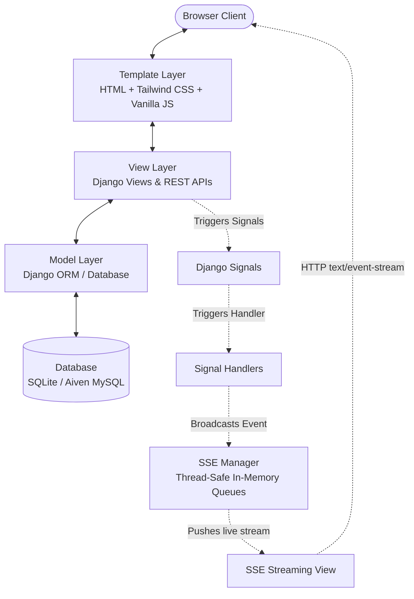

# System Architecture — FoodConnect

FoodConnect is a hyper-local, time-sensitive food donation Django MVT web application. This document details the software design, directory layouts, and execution flow of the application.

---

## 1. Django MVT (Model-View-Template) Mapping

FoodConnect follows Django's standard Model-View-Template architecture, extended with a custom event-driven SSE layer.



### 1.1 Model Layer (`models.py`)
Responsible for schema definitions, database relationships, and validation constraints.
- **`accounts.User`**: Custom user model extending `AbstractUser`. Manages roles (`Donor`, `NGO`, `Admin`), verification status (`is_verified`), active status/bans (`is_banned`), geolocation details, and gamification (`impact_score`).
- **`donations.Donation`**: Tracks food item details, quantity, expiry timestamps, coordinates (lat/lng), status transitions (`Available` ➔ `Claimed` ➔ `Collected`), donor relation, and claiming recipient relation.
- **`donations.Request`**: Stubs NGO food requests (for future feature scope, as defined in `PROJECT_SPEC.md`).
- **`donations.QualityFeedback`**: Holds the post-collection NGO verification survey to record whether the food was acceptable.

### 1.2 View Layer (`views.py` & `services.py`)
Coordinates business logic, state transitions, security validation, and response formatting.
- **Services Pattern**: Core business operations (like claiming, collecting, verifying users, and submitting feedback) are decoupled from views into testable, transaction-safe service functions (e.g., `donations.services.claim_donation`).
- **Authorization & Gates**: Every view is protected via Django authentication checks (`LoginRequiredMixin`, custom decorator gates) ensuring:
  - NGOs cannot claim until verified by an Admin.
  - Banned users are instantly logged out and redirected.
  - Donors cannot access NGO dashboards, and vice versa.
- **REST-style JSON Endpoints**: Used by the reactive frontend components to perform actions asynchronously without reloading the page.

### 1.3 Template Layer (`templates/`)
Renders the visual pages to the user and manages interactive client behavior.
- **Tailwind CSS**: Compiled locally via the Tailwind CLI parser using custom corporate theme tokens (emerald green primary, white backgrounds, and orange warnings).
- **Vanilla JS & Fetch API**: Performs asynchronous request submissions to avoid full-page refreshes.
- **SSE Client Listener**: Listens to the Server-Sent Events stream and reactively patches the DOM when new donations are posted, claimed, or collected.

---

## 2. Directory Layout & Module Structure

```text
src/
├── accounts/          # User registration, role profiles, verification/bans
├── analytics/         # serving/quantity summaries, charts, impact stats
├── core/              # Landing page, leaderboard, admin verification dashboard
├── donations/         # Post donation flow, NGO live feed, claim, feedback survey
├── events/            # Custom signals, handlers, and SSE streaming pipeline
├── foodconnect/       # Django core config (settings, routing, wsgi/asgi)
├── static/            # Static assets and compiled Tailwind output CSS
├── templates/         # HTML template hierarchy
└── tests/             # Comprehensive unit, integration, and security test suites
```

---

## 3. Event-Driven Real-Time Updates (SSE)

Instead of resource-heavy WebSockets or legacy AJAX polling, FoodConnect uses a lightweight, unidirectional **Server-Sent Events (SSE)** channel.

1. **Signals**: Core Django models emit signals when state changes happen (e.g., `donation_posted`).
2. **Handlers**: Signal receivers package relevant metadata into JSON.
3. **SSEManager**: A thread-safe broker (`SSEManager`) registers active connections to client queues (`queue.Queue`) and broadcasts JSON payloads.
4. **SSE Views**: A streaming view (`StreamingHttpResponse`) yields events to connected clients via `text/event-stream` format.
5. **Reactivity**: A script block in the browser receives the event and updates UI elements (adding cards, updating statuses, incrementing scores) in real-time.
