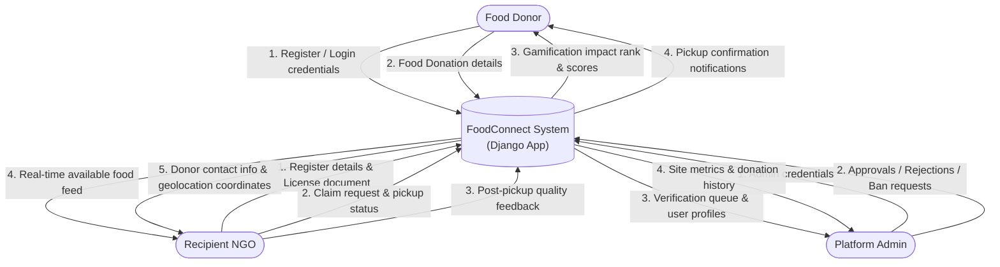
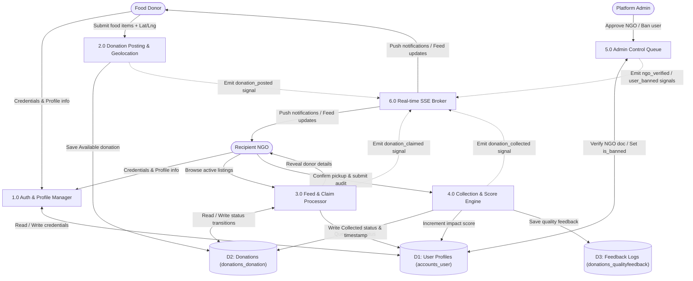
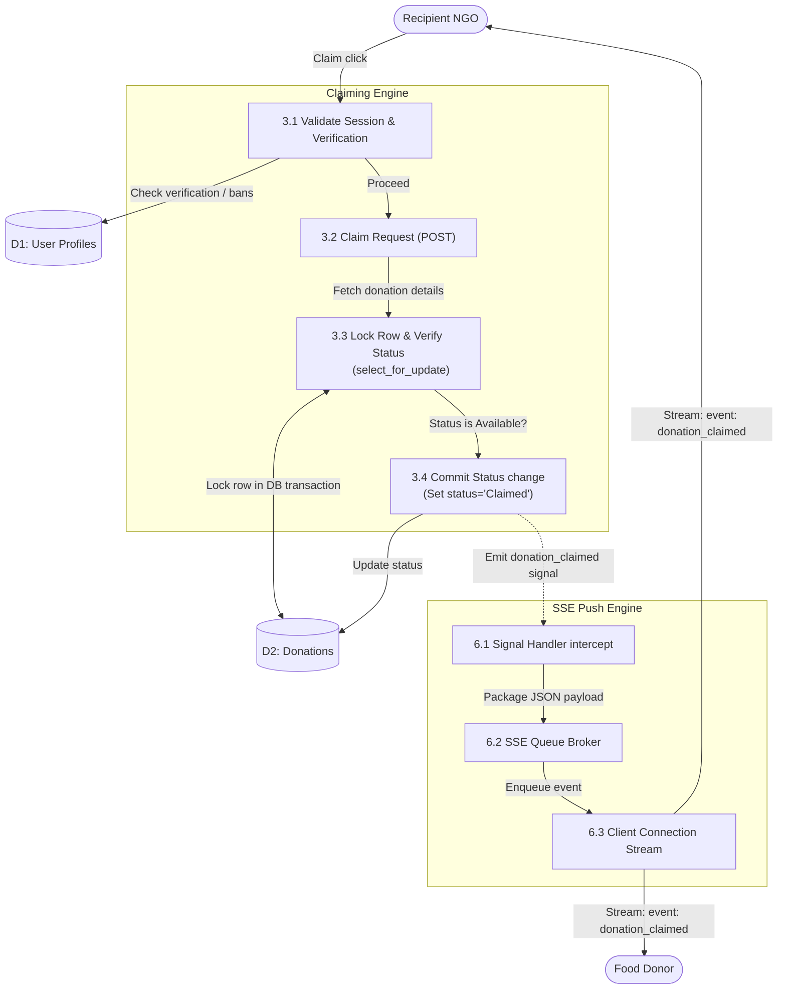

# Data Flow Diagrams (DFD)

This document contains Data Flow Diagrams (DFD) at Level 0, Level 1, and Level 2, outlining the flow of data between users, processes, and database stores in FoodConnect.

---

## 1. DFD Level 0 — Context Diagram
The Context Diagram represents the high-level boundary of the FoodConnect application, showing external entities and their primary interactions.

---

## 2. DFD Level 1 — System Level Diagram
The Level 1 DFD decomposes the system into major functional processes and tracks the flow of data to and from our database stores.

---

## 3. DFD Level 2 — Concurrency-Safe Claiming & Live Update Stream
The Level 2 DFD breaks down the claiming engine (Process 3.0) and the SSE broadcast pipeline (Process 6.0) to highlight the integration of transactional row-level database locks with the reactive push channel.

