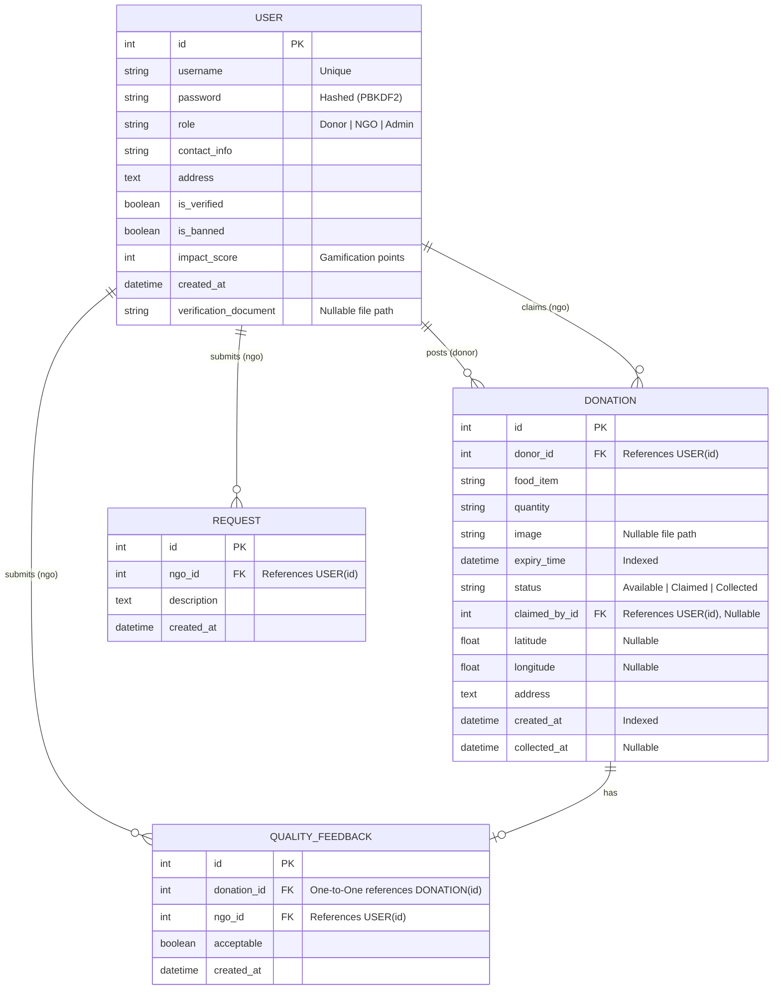

# Entity-Relationship (ER) Diagram & Schema

This document defines the relational database schema for FoodConnect. The database models are implemented using the Django ORM and map to SQLite for local development, and Aiven MySQL for production.

---

## 1. Entity-Relationship Diagram (Mermaid)

---

## 2. Table Schemas & Constraints

### 2.1 Table: `accounts_user`
Stores account profiles, roles, and verification states.

- **Primary Key**: `id` (Auto-incrementing integer)
- **Indexes**: Unique index on `username`.
- **Foreign Key Constraints**: None (extends Django's abstract user model).
- **Constraints**:
  - `role`: Must be one of `['Donor', 'NGO', 'Admin']`.
  - `impact_score`: Default `0`.
  - `is_verified`: Default `False` (for NGOs, modified to `True` for Donors/Admins during save).
  - `is_banned`: Default `False`.

### 2.2 Table: `donations_donation`
Manages the food item posts and lifecycle states.

- **Primary Key**: `id`
- **Foreign Keys**:
  - `donor_id` references `accounts_user(id)` on delete `CASCADE`.
  - `claimed_by_id` references `accounts_user(id)` on delete `SET_NULL` (nullable).
- **Indexes**:
  - Index on `expiry_time` for fast expiration sweeps.
  - Index on `status` to filter available food rapidly.
  - Index on `created_at` for chronological feed ordering.
- **Constraints**:
  - `status`: Must be one of `['Available', 'Claimed', 'Collected']`.

### 2.3 Table: `donations_request`
Stub for future NGO requests.

- **Primary Key**: `id`
- **Foreign Keys**:
  - `ngo_id` references `accounts_user(id)` on delete `CASCADE`.

### 2.4 Table: `donations_qualityfeedback`
NGO quality audit responses for collected donations.

- **Primary Key**: `id`
- **Foreign Keys**:
  - `donation_id` references `donations_donation(id)` on delete `CASCADE` (One-to-One constraint).
  - `ngo_id` references `accounts_user(id)` on delete `CASCADE`.
